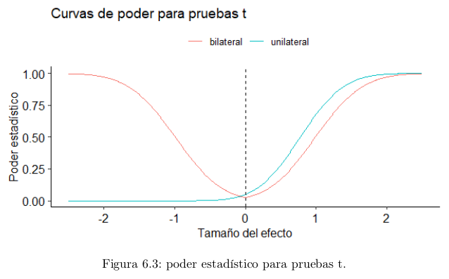

```{r setup, include=FALSE}
knitr::opts_chunk$set(echo = TRUE)
```

## Poder estadístico

-   Error tipo I: Rechazar $H_{0}$ en favor de $H_{A}$ cuando $H_{0}$ es en realidad verdadera.

-   Error tipo II: No rechazar $H_{0}$ en favor de $H_{A}$ cuando $H_{A}$ es en realidad verdadera.

El nivel de significación es una herramienta para representar y controlar la probabilidad de cometer un error de tipo I. Corresponde a la probabilidad de cometer errores de tipo I.

La hipótesis nula representa el mantener las cosaas y creencias como están. Mientras tanto, la hipótesis alternativa describe un cambio de condiciones, por lo que rechazar $H_{0}$ en favor de $H_{A}$ usualmente conlleva un esfuerzo, mayor costo y aprovechar nuevas condiciones.

$\beta$ es la probabilidad de cometer errores de tipo II.

Para un tamaño fijo de la muestra, al reducir $\beta$, $\alpha$ aumenta, y viceversa.

**Poder estadístico o potencia estadística**

Dado por $1-\beta$. Se define como la probabilidad de correctamente rechazar $H_{0}$ cuando es falsa. También define qué tan propensa es la prueba para distinguir un efecto real de una simple casualidad.

**Tamaño del efecto**

Corresponde a la cuantificación de la diferencia entre 2 grupos, o del valor observado con respecto al valor nulo. El tamaño del efecto corresponde a qué tan grande es la diferencia real entre cada par de parámetros.

### Poder, nivel de significación y tamaño de la muestra

En el siguiente gráfico podemos notar lo siguiente:

-   El poder de la prueba **aumenta** mientras **mayor** es el tamaño del efecto (la distancia entre el valor nulo y la media de la muestra).

-   A medida que el tamaño del efecto **disminuye,** el poder se aproxima al nivel de significación.

-   Usar un valor de $\alpha$ más exigente, manteniendo el tamaño de la muestra, hace que la curva de poder sea **más baja** para cualquier tamaño del efecto.

-   Usar una muestra más grande **aumenta** el poder de la prueba para cualquier tamaño del efecto.

La gran desventaja de las pruebas unilaterales es que el poder tiende a cero a medida que el tamaño del efecto aumenta en sentido contrario a la hipótesis alternativa, por lo que no sería posible detectar una diferencia en el sentido opuesto aunque fuese muy grande.

```{r}
library(ggpubr)
library(tidyverse)

#Generar un vector con un rango de valores para el efecto de medias
efecto <- seq(-2.5, 2.5, 0.01)

#Calcular el poder para una prueba t bilateral, para cada tamaño del efecto, asumiendo una muestra con desviación estándar igual a 1.

#Se consideran 4 escenarios para calcular el poder:
#1. Muestra tamaño 6, alpha = 0.05
#2. Muestra tamaño 6, alpha = 0.01
#3. Muestra tamaño 10, alpha = 0.05
#4. Muestra tamaño 10, alpha = 0.01

n6_alpha05 <- power.t.test(n = 6,
                           delta = efecto,
                           sd = 1,
                           sig.level = 0.05,
                           type = "one.sample",
                           alternative = "two.sided")$power

n6_alpha01 <- power.t.test(n = 6,
                           delta = efecto,
                           sd = 1,
                           sig.level = 0.01,
                           type = "one.sample",
                           alternative = "two.sided")$power

n10_alpha05 <- power.t.test(n = 10,
                           delta = efecto,
                           sd = 1,
                           sig.level = 0.05,
                           type = "one.sample",
                           alternative = "two.sided")$power

n10_alpha01 <- power.t.test(n = 10,
                           delta = efecto,
                           sd = 1,
                           sig.level = 0.01,
                           type = "one.sample",
                           alternative = "two.sided")$power

#Construir matriz de datos en formato ancho
datos <- data.frame(efecto, n6_alpha05, n6_alpha01, n10_alpha05, n10_alpha01)

#Llevar a formato largo
datos <- datos %>% pivot_longer(!"efecto",
                                names_to = "fuente",
                                values_to = "poder")

#Formatear fuente como variable categórica
niveles <- c("n6_alpha05", "n6_alpha01", "n10_alpha05", "n10_alpha01")

etiquetas <- c("n=6, alpha0.05", "n=6, alpha=0.01", "n=10, alpha=0.05", "n=10, alpha=0.01")

datos[["fuente"]] <- factor(datos[["fuente"]], levels = niveles, labels = etiquetas)

#Graficar las curvas de poder
g <- ggplot(datos, aes(efecto, poder, colour = factor(fuente)))
g <- g + geom_line()
g <- g + labs(colour = "")
g <- g + ylab("Poder estadístico")
g <- g + xlab("Tamaño del efecto")
g <- g + scale_color_manual(values = c("red", "blue", "chartreuse4", "orange"))
g <- g + theme_pubr()
g <- g + ggtitle("Curvas de poder para prueba t bilateral")
g <- g + geom_vline(xintercept = 0, linetype = "dashed")
print(g)
```

A continuación, se evidencia la ventaja de las pruebas unilaterales: cuando el tamaño del efecto aumenta en el sentido de la hipótesis alternativa, el poder es mayor que para una prueba bilateral.



### Tamaño del efecto

Para poder hacer comparaciones con mayor libertad, existen diferentes medidas estandarizadas de efecto, ya que el tamaño del efecto suele tener una distinta escala, variando de variable en variable.

Al comparar dos medias, existe la **d de Colen**

-   d = 0.2: efecto pequeño

-   d = 0.5: efecto mediano

-   d = 0.8: efecto grande

Cuando se trabaja con una muestra, su ecuación se describe a partir de:

-   $\bar{x}$: media muestral

-   $\mu_{0}$: media teórica para el contraste (valor nulo)

-   $s$: desviación estándar de la muestra con n-1 grados de libertad

$$
d = \frac{\bar{x} - \mu_{0}}{s}
$$

Cuando se trabaja con la diferencia de dos medias no pareadas, si el tamaño de la muestra es mayor a 50, se emplea la siguiente ecuación:

-   $\bar{x}_{1}$, $\bar{x}_{2}$: medias muestrales de cada grupo

-   $n1$, $n2$ son los tamaños de ambas muestras

-   $s_{p}$: desviación estándar agrupada

$$
d = \frac{\bar{x}_{1}-\bar{x}_{2}}{s_{p}}
$$

$$
s_{p} = \sqrt{\frac{\sum{(x-\bar{x}_{1})²+\sum{(x-\bar{x}_{2})²}}}{n_{1} + n_{2} - 2}}
$$

Para muestras pequeñas se emplea un factor de corrección, quedando así:

$$
d = \frac{\bar{x}_{1}-\bar{x}_{2}}{s_{p}}.\frac{n_{1}+n_{2}-3}{n_{1}+n_{2}-2.25}
$$

**Variante de Welch**

$$
d = \frac{\bar{x}_1 - \bar{x}_2}{\sqrt{\frac{s_{1}² + s_{2}²}{2}}}
$$

**Prueba t con muestras pareadas grandes y pequeñas**

$$
d = \frac{\bar{x}_D}{s_D}
$$

$$
d = \frac{\bar{x}_D}{s_D}.\frac{n_{1} - 2}{n_{1} - 1.25}
$$

Se tiene la **h de Cohen,** que es la medida análoga a ocupar cuando se trabaja con probabilidades o proporciones.

Se tienen proporciones $p_1$ y $p_2$:

$$
h = \gamma(p_1) - \gamma(p_2)
$$

$$
\gamma(p) = 2 arcsin(\sqrt{p})
$$

En una distribución binomial la varianza no es constante.

### Poder, tamaño del efecto y tamaño de la muestra

El poder se entiende como qué tan propensa es una proeuba estadística para distinguir un efecto real de una simple casualidad. Sirve para determinar el tamaño adecuado de la muestra para detectar un cierto tamaño del efecto.

Mientras más crece el tamaño de la prueba, más crece el poder estadístico, por lo que se acerca a tener la certeza de rechazar la hipótesis nula si esta es falsa.

```{r}
library(ggpubr)

#Generar un vector con un rango para el tamaño de la muestra
n <- seq(5, 8000, 5)

#Definir constantes
desv_est <- 6
alfa <- 0.05
tam_efecto <- 0.5

#Se calcula el poder con que se detecta el tamaño del efecto para cada tamaño de la muestra, asumiento una prueba bilateral para una sola muestra.
poder <- power.t.test(n = n,
                      delta = tam_efecto,
                      sd = desv_est,
                      sig.level = alfa,
                      type = "two.sample",
                      alternative = "two.sided")$power

#Crear un dataframe
datos <- data.frame(n, poder)

#Graficar la curva de poder
g <- ggplot(datos, aes(n, poder))
g <- g + geom_line(colour = "red")
g <- g + ylab("Poder estadístico")
g <- g + xlab("Tamaño de la muestra")
g <- g + theme_pubr()
g <- g + ggtitle("Relación entre el poder y el tamaño de la muestra")

print(g)
```

### Cálculo teórico del poder

Ejemplo de tiempos de ejecución de dos algoritmos

$H_{0}$: $\mu_{(A_i - B_i)} = 0$, es decir, la media de las diferencias en el tiempo de ejecución necesitados por los algoritmos A y B, para cada posible instancia i, es 0.

$H_{A}$: $\mu_{(A_i - B_i)} \neq 0$

Las áreas correspondientes a la región de rechazo de $H_0$ están coloreadas.

```{r}
library(ggpubr)
library(pwr)

# Fijar valores conocidos
sigma <- 12
alfa <- 0.05
n <- 36
media_nula <- 0

# Calcular el error estándar
SE <- sigma / sqrt(n)

# Graficar la distribución muestral de la media de las diferencias si la hipótesis nula fuera verdadera
x <- seq(-6 * SE, 4 * SE, 0.01)
y <- dnorm(x, mean = media_nula, sd = SE)
df <- data.frame(x, y)  # Crear un DataFrame

g <- ggplot(data = df, aes(x))
g <- g + stat_function(fun = dnorm,
                       args = list(mean = media_nula, sd = SE),
                       colour = "red", size = 1)
g <- g + ylab("")
g <- g + scale_y_continuous(breaks = NULL)
g <- g + scale_x_continuous(name = "Diferencia en tiempos de ejecución [ms]",
                            breaks = seq(-6, 4, 2))
g <- g + theme_pubr()

# Colorear la región de rechazo de la hipótesis nula
Z_critico <- qnorm(alfa/2, mean = media_nula, sd = SE, lower.tail = FALSE)
q_critico_inferior <- media_nula - Z_critico
q_critico_superior <- media_nula + Z_critico

g <- g + geom_area(data = subset(df, x < q_critico_inferior),
                   aes(y = y),
                   colour = "red",
                   fill = "red",
                   alpha = 0.5)
g <- g + geom_area(data = subset(df, x > q_critico_superior),
                   aes(y = y),
                   colour = "red",
                   fill = "red",
                   alpha = 0.5)

# Superponer la distribución muestral de la media de las diferencias si la diferencia de medias fuera -4
media_efecto <- -4
g <- g + stat_function(fun = dnorm,
                       args = list(mean = media_efecto, sd = SE),
                       colour = "blue", size = 1)

# Colorear la región de la nueva curva situada en la región de rechazo de la curva original
x1 <- seq(-6 * SE, 4 * SE, 0.01)
y1 <- dnorm(x1, mean = media_efecto, sd = SE)  # Usar x1 en lugar de x
g <- g + geom_area(data = subset(data.frame(x1, y1), x1 < q_critico_inferior),  # Usar x1 en lugar de x
                   aes(x = x1, y = y1),
                   colour = "blue",
                   fill = "blue",
                   alpha = 0.5)
g <- g + geom_area(data = subset(data.frame(x1, y1), x1 > q_critico_superior),  # Usar x1 en lugar de x
                   aes(x = x1, y = y1),
                   colour = "blue",
                   fill = "blue",
                   alpha = 0.5)

print(g)

```

```{r}
#Calcular el poder de acuerdo al análisis teórico
poder <- pnorm(q_critico_inferior,
               mean = media_efecto,
               sd = SE,
               lower.tail = TRUE) +
         pnorm(q_critico_superior,
               mean = media_efecto,
               sd = SE,
               lower.tail = FALSE)

cat("Poder = ", poder, "\n")

#Calcular la probabilidad de cometer un error de tipo II
beta <- 1 - poder
cat("Beta = ", beta, "\n")
```

Suponer que en realidad el algoritmo B es en promedio 4 milisegundos más rápido que el algoritmo A. Tendríamos la medida de las diferencias es -4 [ms], correspondiente al tamaño del efecto.

La verdadera distribución muestral sería como la curva azul. Al superponer ambas curvas suponiendo que $H_0$ fuera verdadera, se ve que el área de la curva real que se situaría dentro de la región de rechazo de la curva teórica es aquella coloreada en azul. Esta área corresponde al poder de la prueba t (0.516). Puesto que el poder corresponde a la probabilidad de **no** cometer un error de tipo II, se tiene que $\beta = 0.484$.

Por lo que Lola no sería capaz de detectar una diferencia de -4[ms] casi la mitad de las veces.

### Cálculo del poder en R

power.t.test(n, delta, sd, sig.level, power, type, alternative)

-   n: tamaño de la muestra

-   delta: diferencia observada entre las medias (o media muestral y valor nulo)

-   sd: desviación estándar observada

-   sig.level: nivel de significación

-   power: poder de la prueba

-   type: tipo de prueba t de student ("two.sample" para diferencia entre medias, "one.sample" para una sola muestra o "paired" para dos muestras pareadas)

-   alternative: tipo de hipótesis alternative ("one.sided" si es unilateral, "two.sided" si es bilateral)

Al argumento que se quiera calcular se le asigna NULL en la llamada.

Otra función a ocupar es:

pwr.t.test(n, d, sig.level, power, type, alternative)

-   n: tamaño de la muestra

-   d: tamaño del efecto

-   alternative: tipo de hipótesis alternativa ("greater" o "less" si es unilateral, "two.sided" si es bilateral)

Es ideal para una muestra, 2 muestras pareadas o cuando ambas muestras tienen igual tamaño.

Para el caso de 2 muestras independientes se ocupa:

pwr.t2n.test(n1, n2, d, sig.level, power, alternative)

```{r}
library(pwr)

#Fijar valores conocidos
n <- 36
diferencia <- 4
desv_est <- 12
alfa <- 0.05
poder <- 0.9

cat("Cálculo del poder con power.t.test()\n")

resultado <- power.t.test(n = n,
                          delta = diferencia,
                          sd = desv_est,
                          sig.level = alfa,
                          power = NULL,
                          type = "paired",
                          alternative = "two.sided")
print(resultado)

cat("Cálculo del tamaño de la muestra con power.t.test()\n")

resultado <- power.t.test(n = NULL,
                          delta = diferencia,
                          sd = desv_est,
                          sig.level = alfa,
                          power = poder,
                          type = "paired",
                          alternative = "two.sided")

n <- ceiling(resultado[["n"]])
cat("n = ", n, "\n")

#Calcular el tamaño del efecto (d de Cohen)
d <- (4 / desv_est) * ((n-2)/(n-1.25))

cat("\n\nCálculo del poder con pwr.t.test()\n")

resultado <- pwr.test(n = n,
                      d = d,
                      sig.level = alfa,
                      power = NULL,
                      type = "paired", 
                      alternative = "two.sided")
print(resultado)

cat("\nCálculo del tamaño de la muestra con pwr.t.test()\n")
resultado <- pwr.t.test(n = NULL,
                        d = d,
                        sig.level = alfa,
                        power = poder,
                        type = "paired",
                        alternative = "two.sided")
n <- ceiling(resultado[["n"]])
cat("n = ", n, "\n")
```

Para trabajar con proporciones:

power.prop.test(n, p1, p2, sig.level, power, alternative)

-   n: número de observaciones por grupo

-   p1: probabilidad de éxito en un grupo

-   p2: probabilidad de éxito de otro grupo

-   alternative: "one.sided" o "two.sided"

-   pwr.p.test(h, n, sig.level, power, alternative): para pruebas con una única proporción

-   pwr.2p.test(h, n, sig.level, power, alternative): para pruebas con dos proporciones donde ambas muestras son de igual tamaño

-   pwr.2p2n.test(h, n1, n2, sig.level, power, alternative): para pruebas con dos proporciones y muestras de diferente tamaño

-   h: tamaño del efecto

-   alternative: "two.sided", "less" o "greater"
